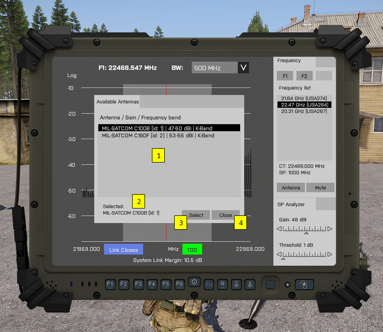

# MILSAT Vision - Documentation
> ### Antenna Configuration

The usable antennas are searched within a radius sphere to player's position. The system calculates rain attenuation and wind load of the antenna.

1. 

**[Back to Index](index.md)**
