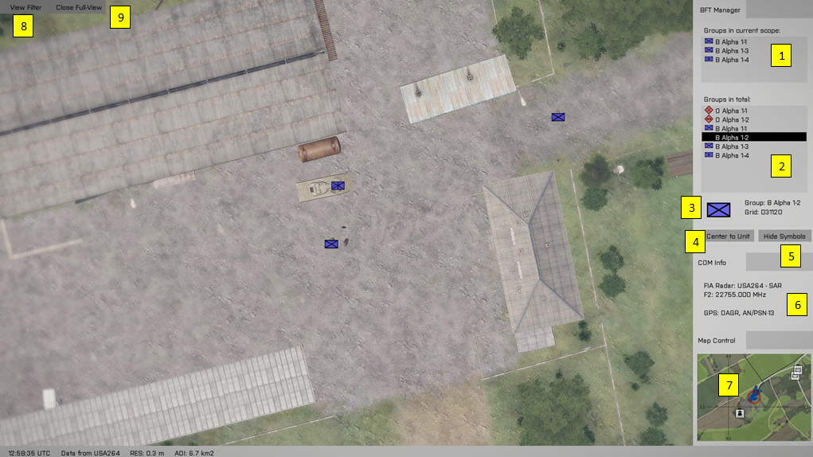
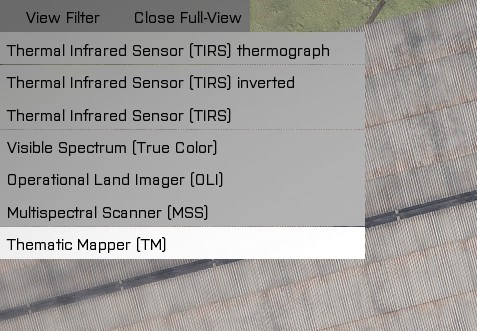

# MILSAT Vision - Documentation
> ### Satellite View - Blue Force Tracker (BFT)

Satellite view interface can show satellite image only when the tracked satellite is in the coverage range and the satellite link is established. If one of the arguments is not met, the empty screen `ERROR! No data transmitted. There is not satellite coverage or the link is closed` is showed.

1. 

2. View Filter

- Thermal Infrared Sensor (TIRS) thermograph
  - Thermal vision - shade of red and green, bodies are white
- Thermal Infrared Sensor (TIRS) inverted
  - Thermal vision - black is hot
- Thermal Infrared Sensor (TIRS)
  - Thermal vision - white is hot
- Visible Spectrum (True Color)
  - Default
- [Operational Land Imager (OLI)](https://landsat.gsfc.nasa.gov/operational-land-imager-oli/)
  - Available only in full screen
- [Multispectral Scanner (MSS)](https://landsat.gsfc.nasa.gov/the-multispectral-scanner-system/)
  - Available only in full screen
- [Thematic Mapper (TM)](https://landsat.gsfc.nasa.gov/the-thematic-mapper/)
  - Available only in full screen

**[Back to Index](index.md)**
