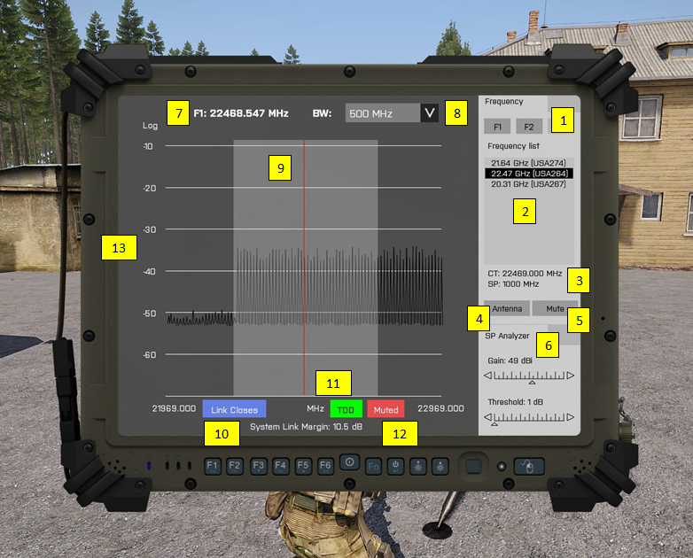

# MILSAT Vision - Documentation
> ### Radio Spectrum Analyzer

Radio spectrum interface is used for setting up and adjusting satellite frequencies. There are two frequency ports at the moment - the first is used as downlink for satellite image and the second contains downlink frequency for [SAR Radar](https://en.wikipedia.org/wiki/Synthetic-aperture_radar) as a part of [Future Imagery Architecture](https://en.wikipedia.org/wiki/Future_Imagery_Architecture) technology. The interface shows the status of system link, duplex emulation and processed signal.

1. Frequency ports
   - F1 - Main frequency port for satellite view downlink
   - F2 - Second frequency port for SAR Radar downlink
2. List of available frequencies - `by selecting, the frequency is set as active`
3. Spectrum analyzer info
   - CT - Center Frequency is shown in spectrum analyzer as red vertical line
   - SP - Frequency Span
4. Antenna button
5. Mute button
6. SP Analyzer - Frequency settings - `adjust within the range of gain and threshold to maintain satellite link open`
   - Automatically set to default values after antenna selection
7. Selected frequency
8. [Bandwidth](https://en.wikipedia.org/wiki/Bandwidth_(signal_processing))
   - Available range is 10 MHz, 50 MHz, 250 MHz and 500 MHz
9. Bandwidth range - graphic
10. [System Link Margin](https://en.wikipedia.org/wiki/Link_margin) (satellite downlink) - `this value must be > 0.0 dB for the link to work`
    - A target value should be within 3 to 6 dB
    - Max. value for the link to work is 16 dB
    - Graphic display of the link margin
      - 0 - 3 dB `Link Closes`
      - 3 - 6 dB `Marginal Link`
      - 6 - 16 dB `Link Closes`
11. [Full-duplex emulation](https://en.wikipedia.org/wiki/Duplex_(telecommunications)) icon - Time-division duplexing (TDD) - `must be active for Blue Force Tracking (BFT) system to work`
    - The icon is shown when the both frequency ports (F1 and F2) are active and the satellite link is established
12. Indicator when the frequency sound is muted
13. Logarithmic signal strength scale
