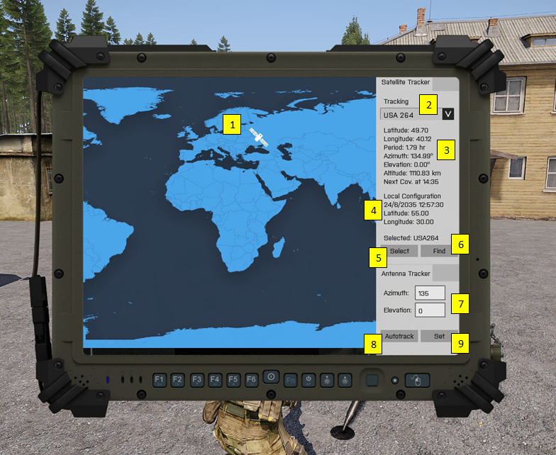

# MILSAT Vision - Documentation
> ### Satellite Tracker

Satellite tracker interface is tracking all the available satellites. The position, at geographic coordinate system, of the satellite is shown at the world map. 

1. Icon of selected satellite at the world map
2. List of available satellites
3. Info of satellite parameters
   - Position at the world map: Latitude (LAT) and Longitude (LON)
   - Orbit Period - `time required to complete exactly one orbit`
