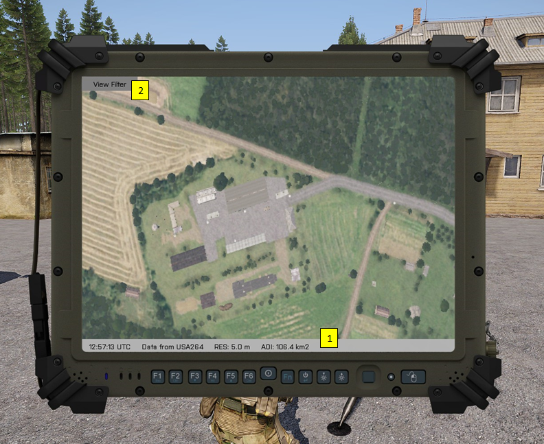

# MILSAT Vision - Documentation
> ### Satellite View

Satellite view interface can show satellite imagery only when the tracked satellite is in the coverage range and the satellite link is established. If one of the arguments is not met, the empty screen `ERROR! No data transmitted. There is not satellite coverage or the link is closed` is showed.

